# Anhang

## API-Routen \label{APIRoutes}

In diesem Abschnitt finden sich alle API-Routen des Backends.
So wird jeder Router in einem Unterabschnitt dargestellt.
Für einen Endpunkt wird immer seine Route, Methode,
Middleware und Response angegeben. Da immer, wenn ein Endpunkt
Daten vom Request erwartet, diese durch eine Entsprechende
Middleware validiert wird, wird der Typ nicht explizit angegeben.
Dieser kann stattdessen aus dem `zod`-Schema abgeleitet werden.
Für die Response-Daten werden Typescript Typen angegeben.
Den Endpunkten stehen folgenden Middleware zur Verfügung:

- `userGuard(userRole?: UserRole)`:
  - Verifiziert anhand des JWT-Token den User
  - Wenn eine `userRole` mitgegeben wurde, muss der User die Rolle haben
- `validateBody(schema: ZodSchema<Body>)`:
  - Validiert den Request-Body nach dem Schema
- `validateQuery(schema: ZodSchema<Body>)`:
  - Validiert die Request-Query nach dem Schema
- `validateParams(schema: ZodSchema<Body>)`:
  - Validiert die Request-Parameter nach dem Schema

Bei jeder einzelnen Route kann noch ein Error zurückgegeben werden. Dieser
hat den folgenden Typen: `type ErrorResponse = { message: string; }`.
Normalerweise wird bei falschen Eingabedaten der Error-Code 400 verwendet,
ansonsten wird der 401 Code für einen Unautorisierten Request und der 404
Code bei einer fehlenden Ressource zurückgegeben.

Für jeden Router wird zudem eine Basisroute angegeben. Diese wird
vor der Route eines einzelnen Endpunktes angehängt. Außerdem stehen die folgenden
Typen und Schemata jedem Router zur Verfügung:

```ts
type Article = {
  id: string;
  title: string;
  summary: string;
  content: string;
  year: number;
  published: boolean;
  updatedAt: Date;
  authorId: string;
};

type Category = {
  id: string
  name: string
};

const idParamsSchema = z.object({
  id: z.string().uuid(),
});
```

### AuthorArticleRouter {.unlisted .unnumbered}

#### Verwendete Typen {.unlisted .unnumbered}

```ts
type ArticleResponse = Omit<Article, "authorId" | "updatedAt">

const categoriesIdsSchema = z.array(z.object({ id: z.string() }));

const articleSchema = z.object({
  title: z.string(),
  summary: z.string(),
  content: z.string(),

  published: z.boolean(),

  categories: categoriesIdsSchema,
});
```

#### Endpunkte {.unlisted .unnumbered}

- Basisroute: /author/articles
- Jeder Endpunkt verwendet die `userGuard("AUTHOR")` Middleware

\begin{center}
\begin{tabular}{ | l l l | }

\hline
Route & Middleware & Response \\
\hline

/ & & \texttt{ArticleResponse[]} \\
GET & & \\

\hline

/:id & \texttt{validateParams(idParamsSchema)} & \texttt{ArticleResponse} \\
GET & & \\

\hline

/ & \texttt{validateBody(articleSchema)} & \texttt{ArticleResponse} \\
POST & & \\

\hline

/:id & \texttt{validateParams(idParamsSchema)} & leeres Object \\
DELETE & & \\

\hline

/:id & \texttt{validateBody(articleSchema.partial())} & \texttt{ArticleResponse} \\
PATCH & \texttt{validateParams(idParamsSchema)} & \\
\hline
\end{tabular}
\end{center}

### AuthorCategoryRouter {.unlisted .unnumbered}

#### Verwendete Typen {.unlisted .unnumbered}

```ts
export const categorySchema = z.object({
  name: z.string(),
});
```

#### Endpunkte {.unlisted .unnumbered}

- Basisroute: /author/categories
- Jeder Endpunkt verwendet die `userGuard("AUTHOR")` Middleware

\begin{center}
\begin{tabular}{ | l l l | }

\hline
Route & Middleware & Response \\
\hline

/ & & \texttt{Category[]} \\
GET & & \\

\hline

/ & \texttt{validateBody(categorySchema)} & \texttt{Category} \\
POST & & \\

\hline

/:id & \texttt{validateParams(idParamsSchema)} & leeres Object \\
DELETE & & \\

\hline

/:id & \texttt{validateBody(categorySchema.partial())} & \texttt{Category} \\
PATCH & \texttt{validateParams(idParamsSchema)} & \\
\hline
\end{tabular}
\end{center}

### AuthRouter {.unlisted .unnumbered}

### Verwendete Typen {.unlisted .unnumbered}

```ts
interface AuthResponse {
  token: string;
  role: UserRole;
}

const loginPayloadSchema = z.object({
  username: z.string().trim(),
  password: z.string(),
});

const registerPayloadSchema = loginPayloadSchema.and(
  z.object({
    registerCode: z.string().uuid(),
  }),
);
```

#### Endpunkte {.unlisted .unnumbered}

- Basisroute: /auth

\begin{center}
\begin{tabular}{ | l l l | }

\hline
Route & Middleware & Response \\
\hline

/login & \texttt{validateBody(loginPayloadSchema)} & \texttt{AuthResponse} \\
POST & & \\

\hline

/register & \texttt{validateBody(registerPayloadSchema)} & \texttt{AuthResponse} \\
POST & & \\

\hline
\end{tabular}
\end{center}

### Image Router {.unlisted .unnumbered}

- Basisroute: /images
- Diese Route wird verwendet um ein externes Bild laden zu können

\begin{center}
\begin{tabular}{ | l l | }

\hline
Route & Response \\
\hline

/:url GET & Content der externen URL \\

\hline
\end{tabular}
\end{center}

### RegisterCodeRouter {.unlisted .unnumbered}

- Basisroute: /auth/registerCodes
- Jeder Endpunkt verwendet die `userGuard("ADMIN")` Middleware

\begin{center}
\begin{tabular}{ | l l l | }

\hline
Route & Middleware & Response \\
\hline

/ & & \texttt{string[]} \\
GET & & \\

\hline

/ &  & \texttt{string} \\
POST & & \\

\hline

/:id & \texttt{validateBody(idParamsSchema)} & \texttt{leeres Object} \\
DELETE & & \\
\hline
\end{tabular}
\end{center}

### SiteConfigRouter {.unlisted .unnumbered}

#### VerwendeteTypen {.unlisted .unnumbered}

```ts
const siteConfigSchema = z.object({
  blogTitle: z.string(),
  logo: z.string(),
  icon: z.string(),
});

type SiteConfigModel = z.infer<typeof siteConfigSchema>;
```

#### Endpunkte {.unlisted .unnumbered}

- Basisroute: /siteConfig
- Jeder Endpunkt außer "/ GET" verwendet die `userGuard("ADMIN")` Middleware

\begin{center}
\begin{tabular}{ | l l l | }

\hline
Route & Middleware & Response \\
\hline

/ & & \texttt{SiteConfigModel[]} \\
GET & & \\

\hline

/ & \texttt{validateBody(siteConfigSchema)} & \texttt{SiteConfigModel} \\
POST & & \\

\hline

/ & \texttt{validateBody(siteConfigSchema.partial())} & \texttt{SiteConfigModel} \\
PATCH & & \\
\hline
\end{tabular}
\end{center}

### UserRouter {.unlisted .unnumbered}

#### Verwendete Typen {.unlisted .unnumbered}

```ts
type User = {
  id: string
  username: string
  password: string
  role: UserRole
};

type UserRole = "ADMIN" | "AUTHOR";

type UserResponse = Pick<User, "id" | "username">;

type FullUserResponse = Omit<User, "password">;

const updateUserSchema = z.object({
  password: z.string(),
});

```

#### Endpunkte {.unlisted .unnumbered}

- Basisroute: /users
- Jeder Endpunkt außer "/me PATCH" verwendet die `userGuard("ADMIN")` Middleware

\begin{center}
\begin{tabular}{ | l l l | }

\hline
Route & Middleware & Response \\
\hline

/ & & \texttt{UserResponse[]} \\
GET & & \\

\hline

/:id & \texttt{validateParams(idParamsSchema)} & leeres Object \\
DELETE & & \\

\hline

/me & \texttt{validateBody(updateUserSchema.partial())} & \texttt{FullUserResponse} \\
PATCH & \texttt{userGuard()} & \\
\hline
\end{tabular}
\end{center}

### VisitorRouter {.unlisted .unnumbered}

#### Verwendete Typen {.unlisted .unnumbered}

```ts
type ArticleWithCategories = Article & { categories: Category[] };

type VisitorArticleResponse = Omit<
  ArticleWithCategories,
  "authorId" | "published" | "updatedAt"
>;

interface VisitorArchiveResponse {
  year: number;
  articleCount: number;
}

interface VisitorCategoryResponse extends Category {
  articleCount: number;
}

const readArticlesQuerySchema = z.object({
  category: z.string().uuid().optional(),
  // `checkInt` transforms the string into a number
  year: z.string().transform(checkInt).optional(),
});
```

#### Endpunkte {.unlisted .unnumbered}

- Basisroute: /

\begin{center}
\begin{tabular}{ | l l l | }

\hline
Route & Middleware & Response \\
\hline

/articles & \texttt{validateQuery} & \texttt{VisitorArticleResponse[]} \\
GET & \texttt{(readArticlesQuerySchema)} & \\

\hline

/articles/:id & \texttt{validateParams(idParamsSchema)} & \texttt{VisitorArticleResponse} \\
GET & & \\

\hline

/archive &  & \texttt{VisitorArchiveResponse[]} \\
GET & & \\

\hline

/categories &  & \texttt{VisitorCategoryResponse[]} \\
GET & & \\

\hline

/categories/:id & \texttt{validateParams(idParamsSchema)} & \texttt{VisitorCategoryResponse} \\
GET & & \\

\hline

\end{tabular}
\end{center}

## Figma Seitenexport \label{FigmaPages}

Die folgenden Abschnitte enthalten des Figma Export aller
Seiten der jeweiligen Anwendergruppe.

### Besucher {.unlisted .unnumbered}

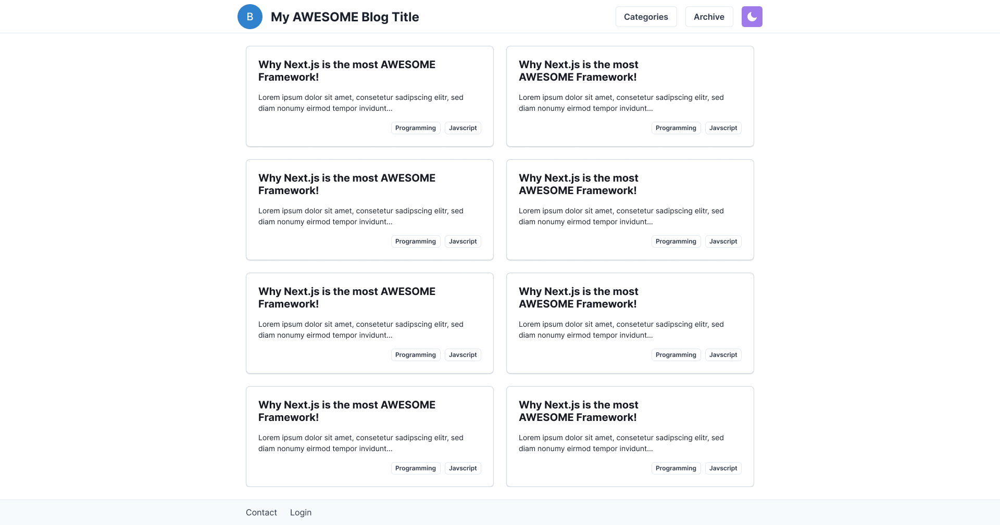

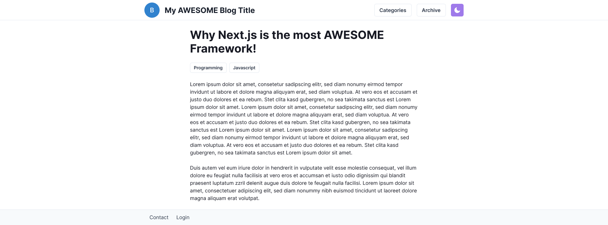

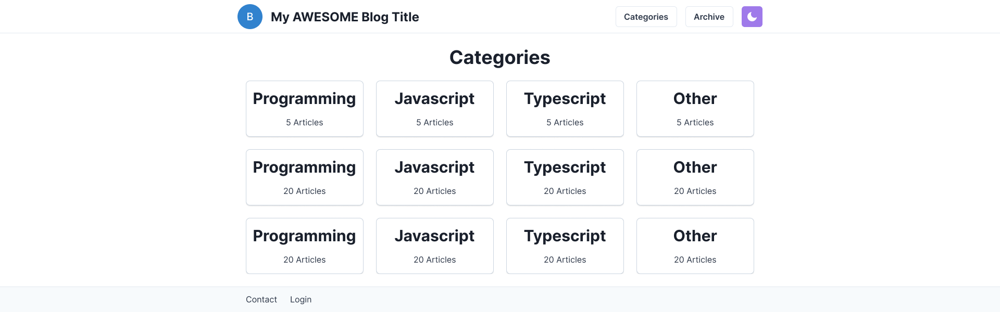

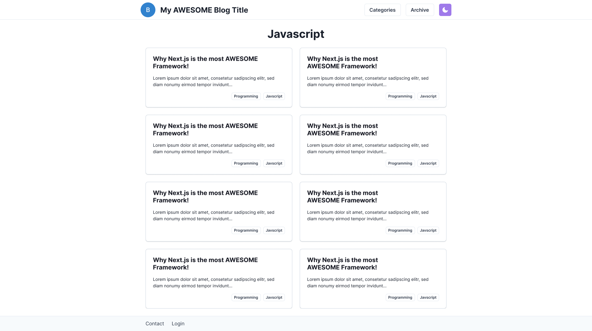

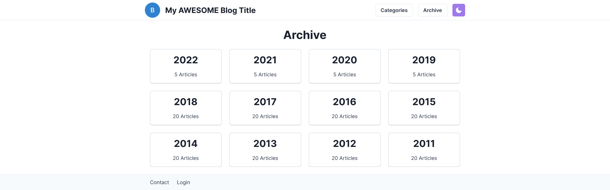

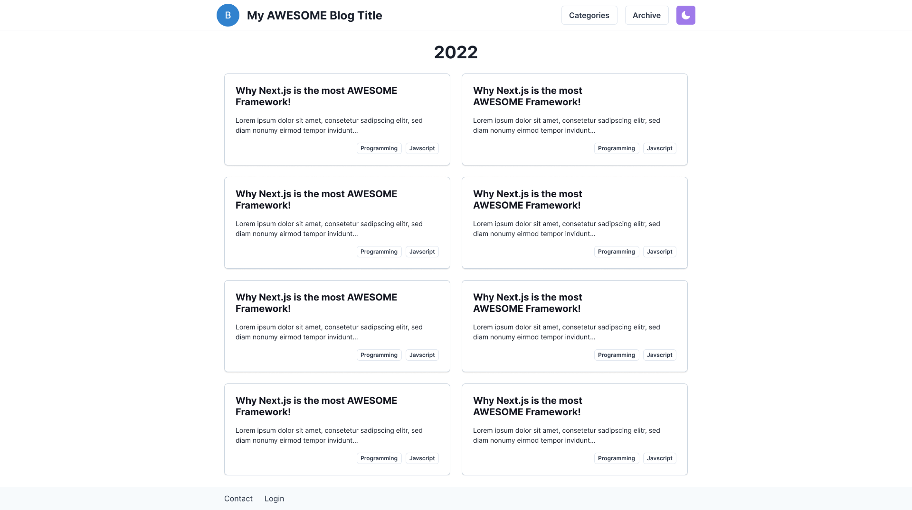

\FloatBarrier

### Autor {.unlisted .unnumbered}

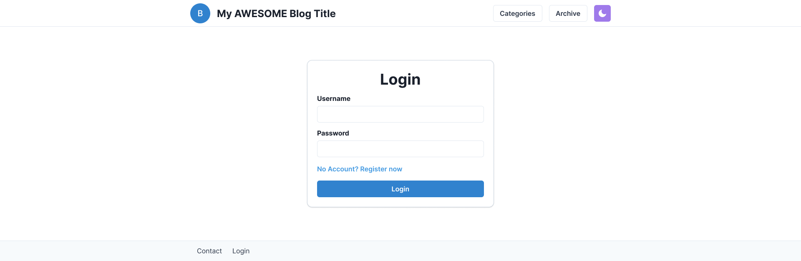

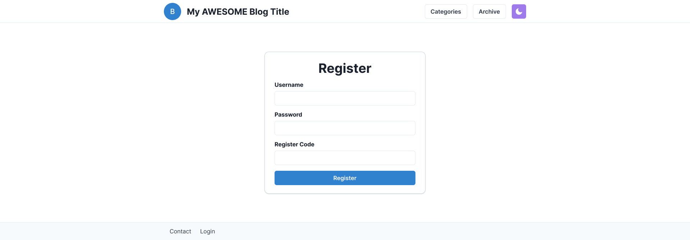

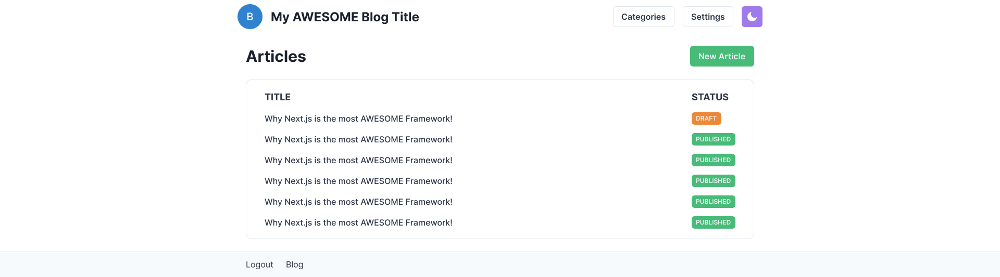

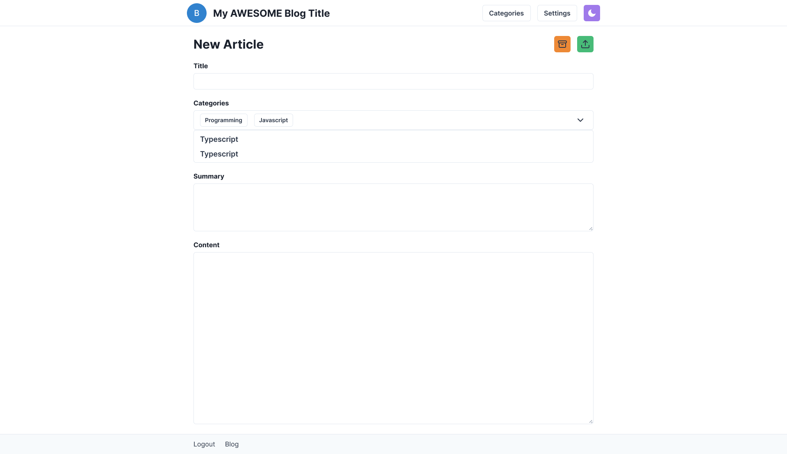

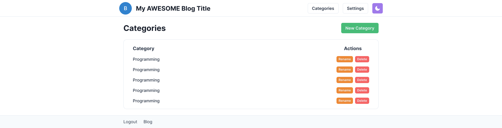

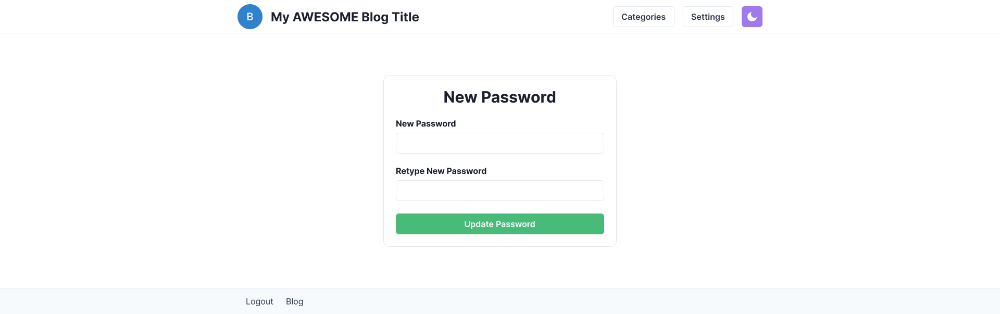

\FloatBarrier

### Administrator {.unlisted .unnumbered}

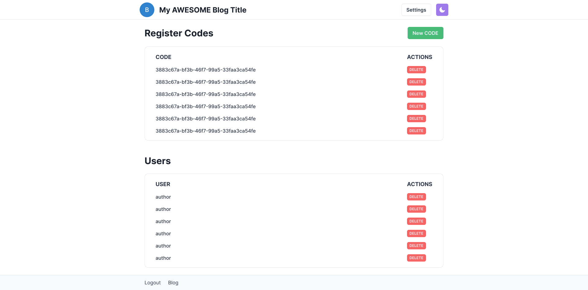

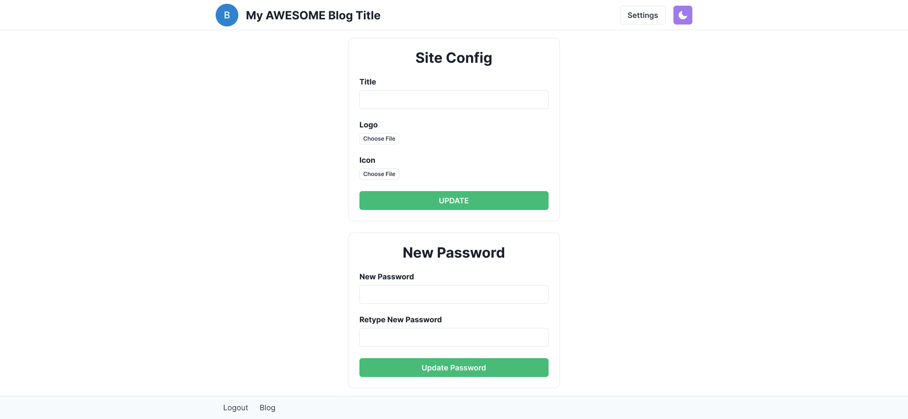

