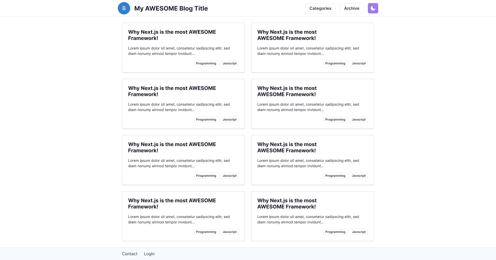

# Design

Bevor das Frontend selbst implementiert werden kann, musste zuerst ein Entwurf
des Designs erstellt werden. Dazu wurde das Designtool _Figma_ verwendet.
Durch dieses konnte der gesamte Entwurf erstellt werden, bevor mit der Entwicklung
selbst begonnen wurde. Da zur Entwicklung `Chakra UI`, eine Komponentenbibliothek,
verwendet werden sollte, wurde auch eine Vorlage für _Figma_ der Bibliothek verwendet. [@ChakraFigma]
Die Komponentenbibliothek bietet einen Grundlegende Komponenten, wie z.B. Buttons oder Formfelder an.
Auch wird einen ein vorgefertigtes Theme mit einer Farbpalette, Schriftarten und Spacing Konfigurationen
angeboten. Ein Export der Seiten des Frontends aus Figma kann im Anhang in \ref{FigmaPages} gefunden werden.
Es wurde zwar ein Design für sowohl die Mobile als auch Desktop Version der Site erstellt, jedoch
enthält der Anhang nur die Desktop Variante.

## Besucher

Wie in den Anforderungen beschrieben wurde, sollte der Besucher der Seite die Möglichkeit haben
eine Liste von Artikeln des Blogs zu erhalten und einzelne Artikel lesen können. Dazu werden
auf der Startseite (siehe Abbildung \ref{VisitorStartpage}) des Blogs alle veröffentlichten Artikel sortiert nach Veröffentlichungsdatum
angezeigt. Die Auflistung der Artikel ist dabei ein Grid aus zwei Spalten von `ArticleCards`.
Auf der `ArticleCard` findet man den Titel, die Zusammenfassung und die Kategorien eines Artikels.
Neben der Auflistung enthält die Startseite eine Navigationsbar, welche die Navigation zur Startseite selbst,
dem Archiv und den Kategorien ermöglicht.

Wenn auf den Titel oder die Zusammenfassung geklickt wird, gelangt man auf die Detailansicht
des Artikels. In diesem findet sich neben den Titel und Kategorien des Artikels noch der eigentliche
Artikelinhalt. Der Inhalt kann dabei Text, Bilder, Listen und Überschriften enthalten.

Neben der Artikelliste der Startseite sollte es noch möglich sein, Artikel gefiltert nach
einer Kategorie oder einem Erscheinungsjahr zu betrachten. Dazu braucht es zuerst die Möglichkeit
alle Kategorien bzw. alle Jahre, indem ein Artikel veröffentlicht wurde, anzeigen. Dazu hat das Frontend
zwei Seiten, welche über die Navigationsbar erreichbar sind. Auf beiden wird ein Grid mit
den jeweiligen Gruppierungen angezeigt. Eine Card enthält dabei entweder das Veröffentlichungsjahr
oder den Namen der Kategorie als Titel und die Artikelzahl der zugehörigen Blogeinträge.
Wenn auf eine Card geklickt wird, wird einen genauso wie auf der Startseite ein Grid von
`ArticleCards` angezeigt. Das Grid enthält dabei nur die gefilterten Artikel. Auch ist über
den Grid ein Titel, welcher das Erscheinungsjahr oder den Namen der Kategorie angibt.

## Autor

Um die Seiten des Autors angezeigt zu bekommen, muss dieser sich zuerst einloggen. Dazu kann
die Loginseite über den Footer erreicht werden. Auf dieser kann eine Form mit einem Username-
und Password-Feld gefunden werden. Auch ist ein Link zur Registrationsseite zu finden.
Die Registrationsseite hat neben den beiden Feldern aus dem Login noch eines für den Registrations-Code.
Durch einen jeweiligen Button kann man den Vorgang starten. Wenn dieser erfolgreich ablief,
wird man zur Startseite navigiert, ansonsten wird ein passender Fehler unter den Eingabefeldern angezeigt.

Nachdem ein Autor sich erfolgreich eingeloggt oder registriert hat, findet sich auf dem Footer der Startseite
anstatt dem Login Link eines für das Dashboard des Autors und einen Link zum Ausloggen. Der Autor kann sich zum Dashboard
navigieren und sieht eine Tabelle von Artikeln, zu sehen in \ref{AuthorDashboard}. Die Tabelle zeigt den Titel des Blogartikels und dem Veröffentlichungsstatus an.
Auch ist über der Tabelle ein Button zum Erstellen eines Artikels enthalten.

Klickt man entweder auf dem Button oder auf einen der Artikel aus der Tabelle, kommt man zum Artikeleditor.
Der Editor enthält ein Textfeld für den Titel und ein Textarea-Feld für die Zusammenfassung und den Inhalt.
Auch hat man eine Auswahl für die Kategorien. Falls man durch einen Artikel aus der Tabelle zu dieser Seite gelangt ist,
werden die Felder mit den bisherigen Werten des Artikels initialisiert. Der Autor kann nun den Blogartikel
editieren. Dabei ist es möglich im Textarea-Feld des Inhalts Markdown zu verwenden. Nach dem Editieren
kann der Autor durch eine Reihe an Buttons seine Arbeit abschließen. Bei einem neuen Artikel kann er diesen
entweder als Draft speichern oder veröffentlichten. Wenn ein bestehen Artikel editiert wird, kann dieser
durch die Buttons gelöscht, gespeichert oder veröffentlicht/gedraftet werden.

Der Autor kann noch durch die Navigationsbar des Dashboards eine Auflistung von Kategorien und die Einstellungen
erreichen. Bei den Kategorien wird auch eine Tabelle angezeigt. Die Tabelle enthält den Namen der Kategorie und
Aktionen, welche auf dieser ausgeführt werden können. So ist es möglich eine Kategorie umzubenennen oder zu löschen.
Auch hier kann durch einen Button über der Tabelle eine neue Kategorie erstellt werden. Im Vergleich zu dem
Artikel wird anstatt eines vollständigen Editors ein Modal für die Aktionen mit den Kategorien angezeigt.

Zuletzt ist es dem Autor möglich auf der Einstellungsseite sein Passwort zu ändern, dafür hat er ähnlich zum Login
eine Eingabeform. In dieser muss er sein neues Password eingeben und dieses durch ein zusätzliches Feld bestätigen.
Wenn die Passwörter übereinstimmen, wird dieses geändert.

## Administrator

Um genauso wie der Autor auf seinen Arbeitsbereich zuzugreifen zu können, muss der Admin sich auch einloggen.
Der Prozess dazu verhält sich gleich wie beim Autor, jedoch wird der Admin zu einem anderen Dashboard (siehe Abbildung \ref{AdminDashboard}) navigiert.
In diesem befinden sich zwei Tabellen, eines für die Registrations-Code und eines für die Nutzerverwaltung.
In der Tabelle für die Registrations-Codes können neue erzeugt und alte gelöscht werden. Die Nutzertabelle
ermöglicht es, alle Nutzernamen der Autoren zu sehen und diese Accounts zu löschen.

Der Administrator hat wie der Autor eine Einstellungsseite. Durch diese kann auch das Passwort des Admins verändert werden.
Es gibt jedoch auch die Möglichkeit die Einstellungen des Blogs zu verändern. Dazu gibt es eine Form
mit einem Textfeld für den Blogtitel und zwei Form-Elemente für den Uploads des Logos. In einem der Elemente
kann ein Favicon und in dem anderen das Logo für die Navigationsbar hochgeladen werden.
