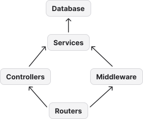
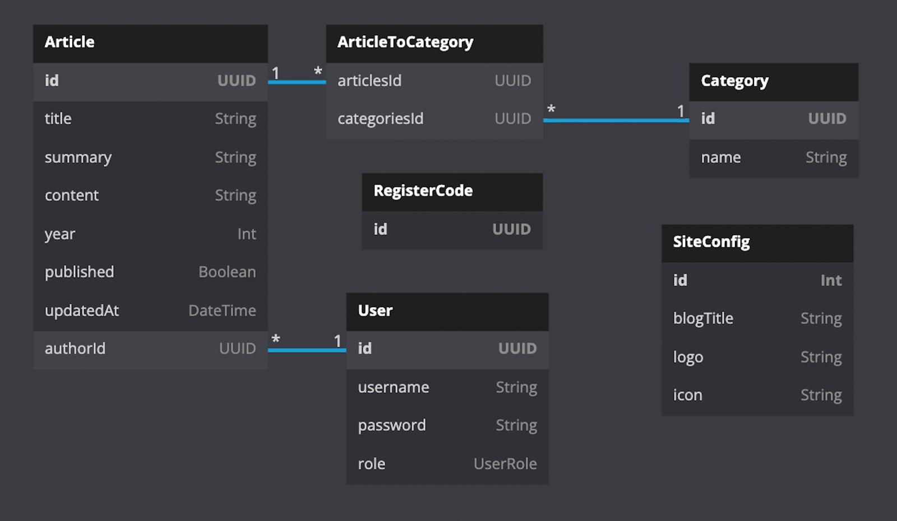

# Backend

Nachdem im vorherigen Kapitel, die benötigen Grundlagen für das System erläutert wurden,
wird in diesem Kapitel das Backend beschrieben. Dieses enthält die Domänenlogik der
Blogging-Plattform und kann durch die von `Prisma` bereitgestellte Schnittstelle,
die Daten persistent Speichern. Um einen Zugriff auf die Daten dem Frontend zu ermöglichen
wird eine REST-Schnittstelle zu Verfügung gestellt. Die Abbildung \ref{componentsBackend}
zeigt die Komponenten, in die das Backend aufgeteilt werden kann, sowohl
ihre Abhängigkeiten untereinander. In den folgenden Abschnitten wird genauer auf
diese Komponenten eingegangen.

## Database

Zur persistenten Speicherung der Nutzerdaten wurde die relationale Datenbank _PostgreSQL_
verwenden. Zur Definition des Datenmodells und der Generation einer Schnittstelle für
das Backend wurde, wie in den Grundlagen beschrieben wurde, `Prisma` verwendet.
Das in `Prisma` beschriebene Datenmodell, wird durch die Grafik \ref{datamodel} dargestellt.

Mit Hilfe des SiteConfig-Models können Einstellungen der Seite gespeichert werden.
Zurzeit ist es möglich den Titel des Blogs und das verwendete Logo einzustellen.
Das Logo und das zugehörige Icon werden im Data URL [@DataUrl] Format gespeichert.
Dadurch können sie einfach an das Frontend gegeben werden und werden direkt als Bild
bzw. Icon angezeigt.

Zum Identifizieren eines Benutzers der Seite, sei es ein Admin oder ein Autor, wird
das User-Model verwendet. Ein Nutzer bekommt so eine eindeutige UUID zugewiesen
und kann zusätzlich durch einen `username` eindeutig identifiziert werden.
Zur Authentifikation wird für den Nutzer ein Passwort verwendet. Dieses wird
mit Hilfe des `argon2` Verfahrens gehashed in der Datenbank gespeichert.
Da nicht jede Person einen Account auf der Plattform erstellen soll, werden
UUIDs als Registrations-Codes verwendet, welche im RegisterCode-Modell gespeichert werden.

Um Autoren das Verfassen von Artikeln zu ermöglichen, gibt es sowohl das Article- und
das Category-Model. Ein Artikel hat neben seinen Inhalt noch die Metainformation,
ob er veröffentlicht wurde und wann die letzte Änderung an diesem vorgenommen wurde.
Zudem hat man durch die `authorId` und dem `author` Feld in Prisma eine Referenz
zum Verfasser. Das Besondere dabei ist, dass im Author-Model ein Feld für alle Artikel
eines Autors angegeben werden muss, da sonst `Prisma` eine 1-1 Beziehung anstatt einer 1-n
Beziehung mit Hilfe eines `UNIQUE` Constrains bilden würde. [@PrismaOneToOne] Zuletzt
kann ein Artikel mehreren Kategorien zugeordnet werden. Da aber auch Kategorien mehrere Artikel
enthalten können, wird eine m-n Relation mit einer Hilfstabelle gebildet. Diese wird von
Prisma automatisch generiert, wenn beide Models ein Feld mit dem jeweiligen anderen Model
als Liste enthalten. Dies vereinfacht die spätere API des generierten `Prisma` Clients.
Wenn jedoch eine solche Tabelle mehr Informationen, als die Schlüssel der beiden Tabelle
enthalten sollte, könnte diese auch explizit erstellt werden.

## Services

Nachdem die Daten persistent in der Datenbank gespeichert werden können und ein Datenmodell
für diese existiert, kann die Domänenlogik für das Backend implementiert werden. Das geschieht
durch die sogenannten Services. Diese bestehen in diesem Projekt hauptsächlich aus CRUD Operationen
auf die Tabellen der Datenbank und der Logik für das Registrieren bzw. den Login.

Zum Zugriff der Datenbank existiert der `DatabaseService`, welcher ein
einfacher Wrapper für den generierten `PrismaClient` ist. Dieser erstellt Getter-Methoden
für den Zugriff auf die Queries des Clients. Außerdem fügt der Service
Middleware dem Client hinzu. Die Middleware für `Prisma` funktioniert ähnlich der von `express`.
In dieser können die Daten für eine Query, bzw. die zurückgegebenen Daten transformiert werden.
So gibt es z.B. eine Middleware die Prüft, dass es nur einen Administrator Account
im System geben kann. Falls versucht wird einen zusätzlichen Administrator zu erstellen wird eine Exception
geworfen. Eine weitere wichtige Middleware ermöglicht das Hashing von Passwörtern. Falls ein neuer User
erstellt oder dass Password des Users verändert werden sollte, hashed die entsprechende Middleware das
Passwort und gibt es anstatt dem originalen Passwort weiter.

Alle weiteren Services hängen vom `DatabaseService` ab. Dazu zählen auch
der `ArticleService` und der `CategoryService`. In diesem werden CRUD Operationen
für das jeweilige Model ermöglicht. In diesem werden meistens einfach die erhaltenen
Daten an den `PrismaClient` weitergeben. Die von erhaltenen Daten müssen manchmal transformiert werden,
um z.B. die Referenzen zwischen einem Artikel und seinen Kategorien zu bilden. Außerdem finden
sich in beiden Services mehrere Leseoperationen für die Daten, da die zurückgegebenen Daten z.B.
für einen Artikel sich je nach Nutzerart unterscheiden.

Zuletzt existiert noch ein `AuthService` für die Authentifikation. Durch diesen wird die Registration, das Login
und die Authentifikation selbst ermöglicht. Für die Registration muss neben einem Nutzernamen und dem Passwort noch
ein existierender Registrations-Code angegeben werden. Wenn der mitgegebene Code legitim ist, wird ein Nutzer in der Datenbank
erstellt. Wenn die Erstellung erfolgreich abgelaufen ist, wird der verwendete Code gelöscht und ein JWT-Token zurückgegebenen.
Der JWT-Token enthält die `id` und die `role` des Benutzers. Beim Login wird nach der richtigen Kombination aus dem
`username` und `password` geprüft. Wenn dies erfolgreich war, wird auch hier ein JWT-Token zurückgegebenen. Zuletzt
gibt es noch eine Methode, mit der ein übergebener JWT-Token geprüft werden kann. Dazu wird dieser zum einen dekodiert und
geprüft, ob dieser Nutzer noch in der Datenbank vorhanden ist. Es kann auch optional übergeben werde, welche Rolle
der Nutzer haben muss. Wenn der Nutzer gefunden wird und seine Rolle mit der übergebenen übereinstimmt, wird dieser
zurückgegebenen.

## Middleware

Die Middleware ist dafür zuständig die eingehenden Requests zu validieren. Dafür gibt es zum einen Funktionen,
welche den Body, die Route-Params oder die Query Parameter mit Hilfe eines `zod` Schemas validieren. Auch gibt es
eine Middleware zur Authentifikation. Die Middleware in diesem Projekt weicht dabei etwas vom `express` Modell ab.
Anstatt einer Middleware den Request, einen Response und die Next-Funktion zu übergeben, erhalten die Middleware
einen Request und geben diesen bei Erfolg weiter. Auch ist es möglich, dass zusätzliche Daten dem Request
mitgegeben werden. Falls jedoch z.B. bei der Authentifikation ein falscher Token mitgegeben wurde, kann eine Exception
geworfen werden und die Middleware-Chain wird abgebrochen. Dadurch lassen sich nicht zwar alle
Funktionalitäten einer herkömmlichen `express` Middleware verwenden, jedoch lässt sich
so eine Validations-Pipeline bilden. Dies wurde vor allem gemacht, um Typsicherheit für die Middleware zu ermöglichen.
So kann z.B. sichergegangen werden, dass nach der Authentifikation-Middleware sicher ein User-Objekt im Request enthalten ist
oder dass der Request-Body dank dem `zod` Schema einen bestimmten Typen hat.

## Controller

Um die Request der API selbst zu verarbeiten, werden die Controller verwenden. Diese erhalten entwendeter direkt einen
Request oder nachdem dieser durch die Middleware durchlaufen ist. Danach werden, wenn nötig die Daten des Request transformiert
und die Domänenlogik aus den Services aufgerufen. Abschließen können noch die erhaltenen Daten von den Services angepasst werden.
So werden z.B. nicht alle Felder eines Artikels, wenn dieser für den Besucher bestimmt ist, zurückgegebenen. Generell gibt es
für jede REST-Ressource einen Controller, wie z.B. einen `SiteConfigController` für die SiteConfig oder einen
`AuthorArticleController` für Artikel bei einem Autor. In diesem finden sich alle benötigten CRUD Operationen für die Ressource.
Eine Ausnahme bildet dabei der `VisitorController`. In diesem werden alle Leseoperationen für erlaubte
Ressourcen für den Besucher implementiert. Dies wurde gemacht, da der Besucher keine Schreibrechte für Ressourcen hat und so sonst
viele einzelne Controller mit nur ein bis zwei Methoden implementiert werden müssten.

## Routers

Zuletzt werden noch Routers verwendet. In diesen werden die Handler für die einzelnen `express` Routen registriert.
So gibt es zu einem Controller auch einen jeweiligen Router.
Die Router sind dabei nur verantwortlich zu bestimmen welche Middleware bei einer Route verwendet wird und
welche Methode bei einem Controller aufgerufen wird. Falls der Controller oder die Middleware eine Exception
wirft, wird eine JSON Objekt mit einer String Message und dem mitgegebenen Error-Code dem Response von `express` gegeben.
Ansonsten wird die Rückgabe vom Controller als JSON im Response gesendet. Im Abschnitt \ref{APIRoutes} des Anhangs
finden sich alle API-Routen des Backends.
